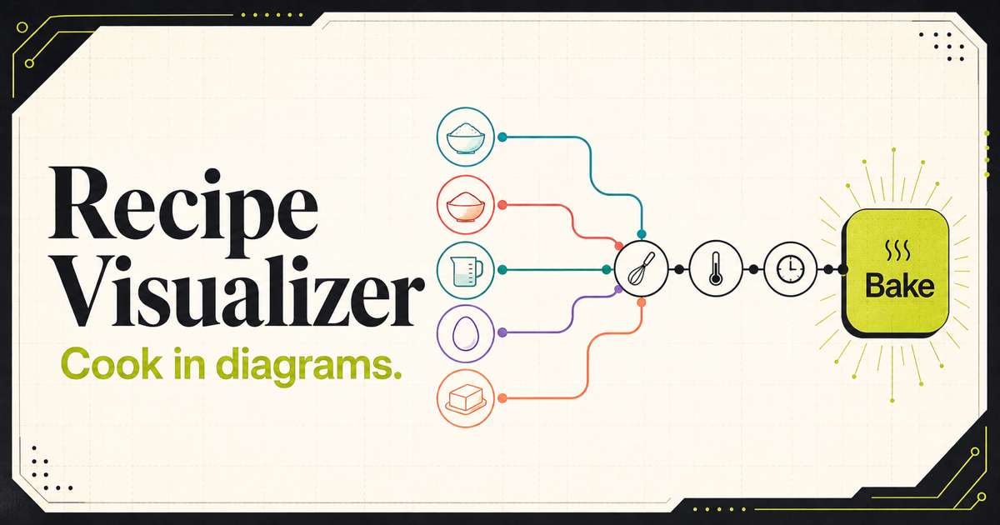
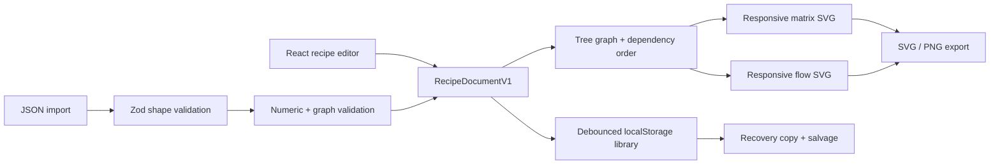

# Recipe Visualizer



Recipe Visualizer is a local-first recipe editor that turns structured cooking
instructions into expressive matrix and flow diagrams. It is a client-side
portfolio project built around a simple idea: a recipe can be both a document
you edit and a system you can see.

Recipes stay in the browser. They can be scaled to a target serving count and
exported as portable Recipe Visualizer JSON, self-contained SVG, or high-
resolution PNG files.

## What it does

- Builds recipes from ingredients, prep notes, and dependency-linked
  operations.
- Captures method, timing ranges, equipment, speed or heat settings, and
  visual doneness cues for each operation.
- Switches between a process-oriented flow view and an ingredient-oriented
  matrix view.
- Scales primary quantities and structured alternate measurements together;
  freeform ingredient notes intentionally remain unscaled.
- Supports light and dark presentation, responsive zooming, mobile
  editor/preview switching, and accessible SVG descriptions.
- Saves a library of up to 50 recipes locally, flushes pending edits when the
  page is hidden, and coordinates changes between browser tabs.
- Validates imports before adding them and normalizes valid operations into
  dependency-first editor order.

## Product walkthrough

1. Choose the sample recipe, duplicate it, or create a blank recipe.
2. Add ingredients and optional alternate amount/unit pairs. Add a note only
   for context that should not scale. Choose a dry, liquid, or neutral line
   style, then optionally add featured emphasis without changing that line.
3. Add operations, record their timing and sensory cues, and select the
   ingredient or earlier-operation inputs each one consumes.
4. Name the final dish and select its final operation. The recipe is marked
   ready only after its numeric values and graph are valid.
5. Preview the matrix or flow diagram, choose a serving count, and export JSON,
   SVG, or PNG.

The editor deliberately applies practical portfolio-scale bounds: 40
ingredients, 24 operations, 8 prep notes, and two alternate measurements per
ingredient. Field lengths are bounded, while diagram labels and instructions
wrap in full rather than being ellipsized.

## Architecture and data flow

The application is React + TypeScript on Vite. Zod validates serialized data;
the domain layer performs graph and numeric checks that go beyond JSON shape
validation.



The diagram renderers calculate their view boxes from graph depth, complete
dynamically wrapped text, and a shared numbered method key containing the
complete cooking instructions. Featured ingredients use an emphasis marker
independent of their dry, liquid, or neutral line geometry. The method cards
form a responsive arrowed sequence with cue panels aligned along
each row. The persistence layer keeps optional `updatedAt` and `originId`
metadata outside recipe documents so existing version 1 exports remain
compatible.

## Local data, recovery, and multiple tabs

There is no account, server database, analytics pipeline, or cloud sync.
Libraries are stored under `recipe-visualizer:library:v1` in local storage.

If saved state is malformed, the original payload is copied to
`recipe-visualizer:library:v1:recovery` before any replacement is written.
Individually valid recipes are salvaged when possible. The in-app recovery
notice can download the raw recovery JSON or reset local data after
confirmation. If the recovery copy cannot be created, the primary value is
left untouched.

Newer changes from another tab load automatically only when the current tab
has no pending edits. Concurrent edits produce an explicit choice to load the
other tab or keep and publish the current tab; the app does not pretend to do
record-level merging.

## JSON compatibility and graph model

Recipe documents use `schemaVersion: 1`. Structured alternate measurements,
operation timing/tool/setting/cue fields, ingredient `featured` emphasis, and
persistence coordination metadata are additive and optional, so earlier
version 1 exports without them remain importable. Legacy ingredients using
`visualStyle: "featured"` remain supported and are rendered with inferred line
geometry plus the new emphasis marker. Legacy `durationMinutes` values remain
supported and are converted to structured timing when edited. Import files are
limited to 1 MB and pass file-size, Zod-shape, and semantic graph validation
before being added.

Version 1 intentionally models a tree, not a general branching graph. An
ingredient or intermediate preparation can feed only one later operation.
When a recipe divides batter, reserves a sauce, or reuses an ingredient at
different points, represent those portions as separate quantities. This keeps
layout, ordering, and editing behavior predictable without hiding the
limitation.

## Accessibility

- Semantic controls and explicit labels cover recipe editing, view switching,
  saving, conflicts, recovery, and export actions.
- Each diagram is an SVG image with a title and description.
- Keyboard focus remains stable while editing prep notes.
- Light and dark themes retain the high-contrast visual language.
- Playwright runs axe checks for serious and critical violations on desktop
  and mobile fixtures.

## Development and testing

### Design kitchen / Storybook

```bash
npm run storybook          # http://127.0.0.1:6006
npm run build-storybook    # standalone output in storybook-static/
npm run test:storybook     # build, then test that static output on port 6007
```

Storybook uses the real React components and app styles, not a separate mock UI.
Start in **Foundations → Design kitchen** for the visual language, then explore
buttons and field states, complete/empty editors, both diagrams, and the full
workspace. The theme toolbar switches Paper/light and Ink/dark; the viewport
menu includes 390 px mobile and 1440 px desktop sizes. **Method cards** has a
width control for inspecting one-, two-, and three-column arrowed layouts.
The width control sets a maximum: standalone cards and complete diagrams both
measure the available display width and reflow, keeping instructions and cues
at about 16 px at normal zoom. Time, temperature, tool and setting are explicitly
labeled in each card, with full method text and a separate “Look for” panel.
Process maps fit the available width within a 65–85% reading scale and enlarged
flow labels (13–17 px at normal zoom). Compact operation spacing and an in-node
finished-dish label reduce horizontal panning. The map has no separate vertical
scrollbar; narrow screens can still pan horizontally. Below 1280 px the workspace
uses editor/preview tabs so the editor doesn't squeeze a readable chart into a
narrow side panel. Zoom affects only the map; the method remains fitted to the
panel below it. The **Method ↓** shortcut
jumps to the instructions. Both the app and full-diagram stories use the same
`RecipeDiagram` presentation, and isolated method stories use its `MethodDiagram`.
SVG and PNG exports combine the entire un-cropped map and full method on a
single sheet at a consistent native type scale, independent of screen pan/zoom.
PNG exports use up to 2× resolution, capped at 32 megapixels and 16,384 px per side.
Minimal and long-text/deep-chain stories share the browser-test fixtures.

Editor and workspace stories run with an in-memory `AppStateProvider`. They
never read or write the saved browser library, listen to its cross-tab events,
or change the document theme. Story edits reset when the story is remounted
(including a theme change). The app itself still persists normally.
The bundled brownie example is not a migration of existing saved recipes:
older local copies keep their original instructions. The **Legacy instructions**
story covers sparse older data without inventing missing metadata or cues.
The original saved brownie can be explicitly replaced using **Recipe file menu →
Restore brownie example**. This requires confirmation and leaves other recipes
and serving preferences unchanged; export the old JSON first to keep a backup.

Design tokens live in `src/styles/design-system.css`; reusable buttons,
statuses, section headings, and view selectors live in `src/components/ui.tsx`.
The system uses a 40 px control rhythm, 10 px control corners, 16 px panel
corners, quiet section icons, visible keyboard focus, and lime for selected
states and primary actions. Keep the SVG palette in `diagram/shared.tsx`
aligned with those tokens: exports need literal colors to remain standalone.

The Storybook suite renders every story, checks typing interactions, runs
light/dark workspace accessibility and storage-isolation checks, and maintains
desktop/mobile workspace snapshots. CI builds and tests Storybook separately;
the app and Storybook deploy as independent Vercel projects. No third-party
visual-testing account is required; Storybook telemetry is disabled.

### App commands

Use Node.js 22 to match CI:

```bash
npm ci
npm run dev
```

The verification commands are:

```bash
npm run lint
npm run typecheck
npm test
npm run build
npx playwright install chromium
npm run test:e2e
```

`npm run test:e2e` creates the production app build and runs Playwright
against `vite preview` at `http://127.0.0.1:4173/`. The browser suite covers
persistence, recovery, cross-tab conflicts, imports, scaling, SVG/PNG exports,
responsive diagrams, accessibility, and desktop/mobile visual baselines.

Before an approved release, `npm run audit:prod` checks production dependency
advisories with `npm audit --omit=dev`. Advisory changes are reviewed rather
than used as a nondeterministic blocking CI gate.

## Independent deployments

The app and Storybook use two Vercel projects connected to the same GitHub
repository. Each has its own production URL, branch previews, deployment
history, and rollback. Both production sites and previews are public.
[Vercel Hobby](https://vercel.com/docs/plans/hobby) is free within its usage
limits for personal, noncommercial projects and supplies `.vercel.app` domains;
no purchased domain, paid add-on, or server is needed. GitHub Actions usage also
counts toward the account's applicable free quotas.

### Project settings

Import the repository twice in Vercel, using these settings for each project:

| Setting | Standalone app | Storybook |
| --- | --- | --- |
| Project name | `recipe-visualizer` | `recipe-visualizer-storybook` |
| Root directory | Repository root | Repository root |
| Framework preset | Vite | Other |
| Node.js version | 22.x | 22.x |
| Install command | `npm ci` | `npm ci` |
| Build command | `npm run build` | `npm run build-storybook` |
| Output directory | `dist` | `storybook-static` |
| Production branch | `main` | `main` |
| Required GitHub deployment checks | Quality, App | Quality, Storybook |

Keep these build settings in the individual Vercel projects. A shared
root-level `vercel.json` with a build command or output directory would affect
both imports. Accept an available project/domain suffix if the requested name
is already taken; record the actual production domains below after verification.
Leave ignored-build/path filtering disabled so both sites build for every change.

The app is served at `/` in development, CI, production, and previews. An
explicit `VITE_BASE_PATH` can still override its base for another static host;
GitHub Actions no longer changes the base implicitly. Leave this variable unset
in both Vercel projects. Storybook always uses its own relative asset base.

### CI and production gates

The verification-only workflow in `.github/workflows/ci.yml` runs on pull
requests, pushes to `main`, and manual dispatch. Its three independent jobs use
Node.js 22, `npm ci`, and actions pinned to full commit SHAs:

- **Quality:** lint, typecheck, and unit/component tests.
- **App:** build `dist` once, then run browser, accessibility, and visual tests
  against that build.
- **Storybook:** build `storybook-static` once, then run story, interaction,
  accessibility, storage-isolation, and visual tests against that build.

In each project's **Settings → Deployment Checks → Add Checks**, select
**GitHub** as the provider and require the checks listed in the settings table.
Keep automatic production domain assignment enabled. These gates are configured
in Vercel, not by the workflow itself: **Quality + App** controls app production,
while **Quality + Storybook** controls Storybook production. Keep the job names
stable, or update the selected checks when renaming them. See
[Vercel Deployment Checks](https://vercel.com/docs/deployment-checks).

A push to `main` builds both projects, but a production domain updates only
after its required checks pass. A failed site-specific check leaves that site's
previous production version in place without blocking the other site's gate.
Feature-branch pushes create separate preview URLs; opening a pull request also
runs CI. Previews can be inspected before checks pass. Vercel rebuilds the same
commit separately from CI; the deployed files are not the exact CI-tested
artifacts. No deployment credentials are needed in GitHub Actions.

Disable **Vercel Authentication** under **Settings → Deployment Protection** in
both projects so production and preview links open without login. Preserve
Vercel's default fork-deployment approval behavior. Dependabot continues to
cover npm dependencies and GitHub Actions.

### Initial setup and verification

1. Connect the checkout to the intended GitHub repository, preserving its source
   visibility. Commit the complete app and Storybook source, including this
   workflow, and get all three checks passing on `main` before the first import.
2. Import the repository twice with the project settings above, configure the
   GitHub deployment checks, and make both projects publicly accessible.
3. Use a subsequent deployment to confirm the gates are active: the production
   domain should stay on its previous version while required checks are pending
   or failing. Before sharing the sites, run a failure drill on a temporary
   validation branch: select it as production in both projects, add a failing
   app-only browser assertion there, and dispatch CI on that branch. Confirm
   app promotion is blocked while Storybook remains eligible. Restore both
   production branches to `main` and redeploy the passing commit afterward.
   Never merge the intentional failure into `main`.
4. Open a pull request and verify that it receives distinct app and Storybook
   preview URLs while both production domains remain unchanged.
5. In a signed-out browser, verify both production and preview URLs. Check app
   editing, reload persistence, SVG/PNG exports, fonts, and icons. Check the
   Storybook sidebar, direct story/docs links and refresh, themes, and mobile
   layouts. Confirm a failure in one project's checks does not prevent the
   other project from promoting when its own checks pass.
6. Record the verified production URLs here. Disable any previous GitHub Pages
   site only after the new URLs work; the old publishing workflow has been removed.

| Deployment | Verified production URL |
| --- | --- |
| Standalone app | Pending GitHub/Vercel setup and signed-out verification |
| Storybook | Pending GitHub/Vercel setup and signed-out verification |

Recipe libraries are scoped to the browser origin. Production and preview URLs
have separate local libraries, and Storybook uses only in-memory fixtures. Use
JSON export/import to transfer recipes between origins.

### Rollback and recovery

Open the affected Vercel project's **Deployments** page and use **Instant
Rollback** to restore its previous successful production deployment. Hobby
supports rolling back to the immediately preceding production deployment. The
other project is unaffected. Verify the stable production URL after rollback.
[Vercel rollback documentation](https://vercel.com/docs/instant-rollback).

Rollback disables automatic production domain assignment. Revert or fix the
source change in GitHub, wait for the required checks to pass, and use **Undo
Rollback** to promote the corrected deployment. This also restores automatic
production assignment for future `main` updates. No recipe data is migrated or deleted by
a hosting rollback. Keep both projects on Hobby and review usage in the provider
dashboards rather than enabling paid services to bypass quotas.
