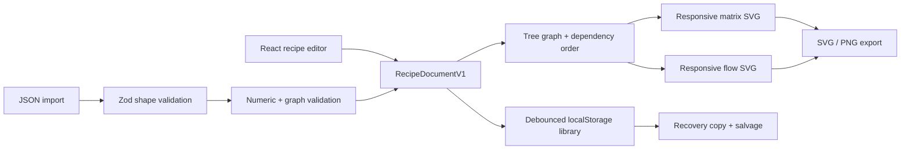

# Recipe Visualizer


Recipe Visualizer is a local-first recipe editor that turns structured cooking
instructions into expressive matrix and flow diagrams. It is a client-side
portfolio project built around a simple idea: a recipe can be both a document
you edit and a system you can see.

Recipes stay in the browser. They can be scaled to a target serving count and
exported as portable Recipe Visualizer JSON, self-contained SVG, or high-
resolution PNG files.

## What it does

- Builds recipes from ingredients, prep notes, and dependency-linked
  operations.
- Switches between a process-oriented flow view and an ingredient-oriented
  matrix view.
- Scales primary quantities and structured alternate measurements together;
  freeform ingredient notes intentionally remain unscaled.
- Supports light and dark presentation, responsive zooming, mobile
  editor/preview switching, and accessible SVG descriptions.
- Saves a library of up to 50 recipes locally, flushes pending edits when the
  page is hidden, and coordinates changes between browser tabs.
- Validates imports before adding them and normalizes valid operations into
  dependency-first editor order.

## Product walkthrough

1. Choose the sample recipe, duplicate it, or create a blank recipe.
2. Add ingredients and optional alternate amount/unit pairs. Add a note only
   for context that should not scale.
3. Add operations and select the ingredient or earlier-operation inputs each
   one consumes.
4. Name the final dish and select its final operation. The recipe is marked
   ready only after its numeric values and graph are valid.
5. Preview the matrix or flow diagram, choose a serving count, and export JSON,
   SVG, or PNG.

The editor deliberately applies practical portfolio-scale bounds: 40
ingredients, 24 operations, 8 prep notes, and two alternate measurements per
ingredient. Labels are bounded for reliable diagram composition.

## Architecture and data flow

The application is React + TypeScript on Vite. Zod validates serialized data;
the domain layer performs graph and numeric checks that go beyond JSON shape
validation.



The diagram renderers calculate their view boxes from graph depth and bounded
wrapped text. The persistence layer keeps optional `updatedAt` and `originId`
metadata outside recipe documents so existing version 1 exports remain
compatible.

## Local data, recovery, and multiple tabs

There is no account, server database, analytics pipeline, or cloud sync.
Libraries are stored under `recipe-visualizer:library:v1` in local storage.

If saved state is malformed, the original payload is copied to
`recipe-visualizer:library:v1:recovery` before any replacement is written.
Individually valid recipes are salvaged when possible. The in-app recovery
notice can download the raw recovery JSON or reset local data after
confirmation. If the recovery copy cannot be created, the primary value is
left untouched.

Newer changes from another tab load automatically only when the current tab
has no pending edits. Concurrent edits produce an explicit choice to load the
other tab or keep and publish the current tab; the app does not pretend to do
record-level merging.

## JSON compatibility and graph model

Recipe documents use `schemaVersion: 1`. Structured
`alternateMeasurements` and persistence coordination metadata are additive and
optional, so earlier version 1 exports without them remain importable. Import
files are limited to 1 MB and pass file-size, Zod-shape, and semantic graph
validation before being added.

Version 1 intentionally models a tree, not a general branching graph. An
ingredient or intermediate preparation can feed only one later operation.
When a recipe divides batter, reserves a sauce, or reuses an ingredient at
different points, represent those portions as separate quantities. This keeps
layout, ordering, and editing behavior predictable without hiding the
limitation.

## Accessibility

- Semantic controls and explicit labels cover recipe editing, view switching,
  saving, conflicts, recovery, and export actions.
- Each diagram is an SVG image with a title and description.
- Keyboard focus remains stable while editing prep notes.
- Light and dark themes retain the high-contrast visual language.
- Playwright runs axe checks for serious and critical violations on desktop
  and mobile fixtures.

## Development and testing

Use Node.js 22 to match CI:

```bash
npm install
npm run dev
```

The verification commands are:

```bash
npm run lint
npm run typecheck
npm test
npm run build
npx playwright install chromium
npm run test:e2e
```

`npm run test:e2e` creates the production Pages build and runs Playwright
against `vite preview` at `/recipe-visualizer/`. The browser suite covers
persistence, recovery, cross-tab conflicts, imports, scaling, SVG/PNG exports,
responsive diagrams, accessibility, and desktop/mobile visual baselines.

Before an approved release, `npm run audit:prod` checks production dependency
advisories with `npm audit --omit=dev`. Advisory changes are reviewed rather
than used as a nondeterministic blocking CI gate.

## GitHub Pages deployment

The workflow in `.github/workflows/pages.yml` pins third-party actions to full
commit SHAs. Its test job installs dependencies, lints, typechecks, runs unit
and component tests, creates the Pages build once, and tests that exact
artifact. The same `dist` directory is uploaded and deployed without a second
build.

In GitHub, set **Settings → Pages → Source** to **GitHub Actions**. The
production Vite base is `/recipe-visualizer/`. Pushes to `main` deploy after the
test job passes; pull requests run the same verification without deploying.
Dependabot is configured for npm and GitHub Actions updates.

A public site link is intentionally omitted until this checkout has a real
repository origin and confirmed Pages deployment URL.
